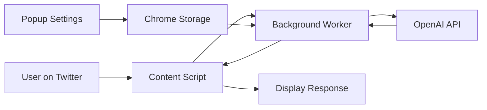

# 🤖 AI Tweet Helper Chrome Extension

A powerful Chrome extension that brings AI-powered assistance directly to Twitter/X, helping you craft better tweets, generate smart replies, and engage more effectively on social media.

## ✨ What It Does

**AI Tweet Helper** transforms your Twitter/X experience by providing intelligent, contextual AI assistance right where you need it. The extension adds AI-powered buttons directly to the Twitter interface, allowing you to:

### � **Smart Tweet Generation & Enhancement**
- **Generate Original Tweets**: Create engaging content from scratch
- **Improve Draft Tweets**: Enhance your existing drafts with AI suggestions
- **Smart Replies**: Generate contextual, thoughtful replies to other users' tweets
- **Thread Creation**: Build comprehensive tweet threads on complex topics

### 🎭 **Customizable AI Behavior**
- **Multiple Tone Options**: Professional, Friendly, Enthusiastic, Thoughtful, Casual, or Witty
- **Custom Instructions**: Add your own specific prompts for personalized AI behavior
- **Daily Focus Topics**: Set themes for consistent messaging throughout the day
- **Response Length Control**: Choose from Short, Medium, Long, or Detailed responses

### ⚡ **Seamless Integration**
- **Native Twitter UI**: AI buttons appear naturally in Twitter's interface
- **One-Click Access**: Instant AI assistance without leaving the page
- **Real-time Analysis**: AI understands tweet context and suggests relevant responses
- **Secure & Private**: All data stored locally, API key never shared

## 🚀 Installation & Setup

### Quick Install (Recommended)

1. **Download & Install:**
   ```bash
   git clone https://github.com/felipeotarola/x-chrome-extension.git
   cd x-chrome-extension
   npm install
   npm run build:extension
   ```

2. **Load in Chrome:**
   - Open Chrome → `chrome://extensions/`
   - Enable "Developer mode" (top right toggle)
   - Click "Load unpacked" → Select the `extension` folder

3. **Configure API:**
   - Click extension icon in Chrome toolbar
   - Click settings gear ⚙️
   - Enter your [OpenAI API key](https://platform.openai.com/api-keys)
   - Customize your preferences (tone, length, etc.)
   - Click "Save Settings"

### Prerequisites
- **Node.js 18+** - [Download here](https://nodejs.org/)
- **OpenAI API Key** - [Get yours here](https://platform.openai.com/api-keys)
- **Google Chrome** - Developer mode enabled

## 🎯 How to Use

### 1. **On Twitter/X Homepage**
- Navigate to [twitter.com](https://twitter.com) or [x.com](https://x.com)
- Use keyboard shortcut `Ctrl+Shift+H` to activate AI help on all visible tweets
- Click the **🤖 AI Help** buttons that appear on tweets

### 2. **Smart Tweet Composition**
- Start writing a tweet in the compose box
- Click the **AI Help** button in the toolbar
- Choose from:
  - **Generate Tweet** - Create original content
  - **Improve Draft** - Enhance your text
  - **Change Tone** - Adjust the style
  - **Create Thread** - Build multi-tweet threads

### 3. **Intelligent Replies**
- Click reply on any tweet
- Use the **AI Reply** button for contextual suggestions
- AI analyzes the original tweet and generates relevant responses

## 🏗️ Code Architecture

### Project Structure
```
x-chrome-extension/
├── app/                      # Next.js application
│   ├── api/generate-tweet/   # API endpoints for AI processing
│   ├── popup/               # Extension popup pages
│   └── layout.tsx           # App layout
├── extension/               # Built extension files (generated)
├── extension-scripts/       # Source extension scripts
│   ├── background.js        # Service worker & AI logic
│   ├── content.js          # Twitter UI injection
│   └── content.css         # Extension styling
├── public/                  # Static assets & popup files
│   ├── popup-clean.html    # Main popup interface
│   ├── popup.js            # Popup functionality
│   └── manifest.json       # Extension manifest
├── scripts/                 # Build utilities
└── types/                   # TypeScript definitions
```

### Core Components

#### **🔧 Background Service Worker** (`background.js`)
- **AI Integration**: Direct OpenAI API communication
- **Settings Management**: Retrieves user preferences from Chrome storage
- **Prompt Engineering**: Builds dynamic prompts based on tone, length, and custom instructions
- **Error Handling**: Graceful fallbacks and error recovery

#### **🌐 Content Script** (`content.js`)
- **DOM Manipulation**: Injects AI buttons into Twitter's interface
- **Event Handling**: Manages user interactions with AI features
- **UI Integration**: Seamlessly blends with Twitter's native design
- **Message Passing**: Communicates with background script

#### **🎨 Popup Interface** (`popup-clean.html` + `popup.js`)
- **Settings Management**: User configuration interface
- **API Key Storage**: Secure local storage of credentials
- **Preference Controls**: Tone, length, custom prompts, daily focus
- **Status Indicators**: Real-time extension status display

#### **⚡ Next.js API Layer** (`app/api/`)
- **Tweet Generation**: Alternative AI processing endpoint
- **Type Safety**: Full TypeScript implementation
- **Request Validation**: Input sanitization and error handling

### Technology Stack

#### **Frontend**
- **Next.js 14** - React framework with App Router
- **TypeScript** - Type-safe development
- **Tailwind CSS** - Utility-first styling
- **Chrome Extension APIs** - Native browser integration

#### **AI & APIs**
- **OpenAI GPT-3.5/4** - Natural language processing
- **Chrome Storage API** - Settings persistence
- **Chrome Scripting API** - Dynamic content injection

#### **Build & Development**
- **Custom Build Scripts** - Extension packaging automation
- **ESLint** - Code quality enforcement
- **PostCSS** - CSS processing pipeline

### Data Flow



1. **User Interaction**: User clicks AI button on Twitter
2. **Content Script**: Captures tweet context and user action
3. **Background Worker**: Retrieves settings, builds AI prompt
4. **OpenAI API**: Processes request and returns AI response
5. **Response Display**: Content script shows AI suggestion to user
6. **Settings Flow**: Popup manages preferences via Chrome Storage

### Key Features Implementation

#### **Dynamic Prompt Building**
```javascript
// Combines user settings into comprehensive AI instructions
const systemPrompt = `Base instructions...
Tone: ${toneInstructions[tone]}
Length: ${lengthInstructions[responseLength]}
${customPrompt ? `Additional: ${customPrompt}` : ''}
${currentFocus ? `Today's Focus: ${currentFocus}` : ''}`;
```

#### **Token Management**
```javascript
// Adjusts AI response length based on user preference
const maxTokensMap = {
  'short': 80,    'medium': 150,
  'long': 250,    'detailed': 400
};
```

#### **Secure Storage**
```javascript
// All sensitive data stored locally in Chrome
chrome.storage.sync.set({
  apiKey, tone, customPrompt, currentFocus, responseLength
});
```

## 🔧 Development

### Available Scripts
```bash
npm run dev              # Next.js development server
npm run build           # Build complete application
npm run build:extension # Build extension only
npm run lint           # Code quality check
```

### Development Workflow
1. **Make Changes** - Edit source files in `extension-scripts/`, `public/`, or `app/`
2. **Build Extension** - Run `npm run build:extension`
3. **Reload Extension** - Go to `chrome://extensions/` and click reload
4. **Test Changes** - Use extension on Twitter/X

### Debugging
- **Extension Console**: `chrome://extensions/` → Click "background page"
- **Content Script**: Browser DevTools → Console tab
- **Popup Debugging**: Right-click extension icon → Inspect popup

## 📸 Screenshots


## 🤝 Contributing

1. Fork the repository
2. Create a feature branch: `git checkout -b feature-name`
3. Make your changes and test thoroughly
4. Submit a pull request with clear description

## 📄 License

This project is open source. Feel free to use, modify, and distribute.

## 🔗 Links

- **Creator**: [@FelipeOtar40115](https://x.com/FelipeOtar40115)
- **Repository**: [GitHub](https://github.com/felipeotarola/x-chrome-extension)
- **Issues**: [Report bugs or request features](https://github.com/felipeotarola/x-chrome-extension/issues)
